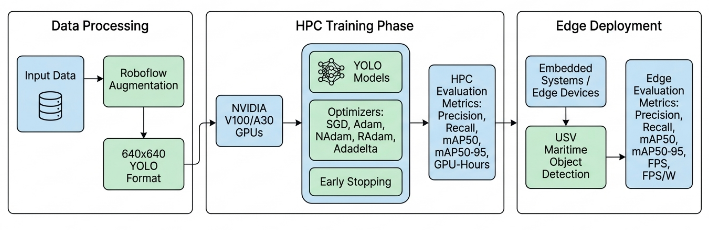

# HPC-to-Edge Green AI Optimizer Comparison

[](LICENSE)

This repository contains the experimental material and results associated with the study:

> **Optimizing the HPC-to-Edge Continuum: The Role of First-Order Optimizers in Green AI Training and Real-Time Deep Learning Inference**

The study investigates the role of first-order optimization algorithms across the deep learning lifecycle, from HPC-based training to deployment on GPU and edge-computing platforms. The experimental analysis uses YOLO-based object detection for a maritime/USV scenario and evaluates predictive performance, convergence behaviour, computational cost, energy efficiency, and inference performance.

Five optimizers are evaluated:

- **SGD** 
- **Adam**
- **NAdam**
- **RAdam**
- **Adadelta**

The study combines replicated training experiments on **NVIDIA Tesla V100** and **NVIDIA A30** GPUs with inference benchmarks on an **NVIDIA RTX 3090** and **NVIDIA Jetson AGX Orin**.

---

## 1. Study Overview

The main objective is to characterize optimizer selection as a design variable that affects both:

1. **Model performance** — precision, recall, mAP50 and mAP50-95.
2. **HPC training efficiency** — training time, convergence epochs, GPU-hours and estimated energy consumption.
3. **Green AI efficiency** — predictive performance normalized by estimated energy consumption.
4. **Edge deployment performance** — inference latency, FPS, power consumption and FPS/W.
5. **Hardware interaction** — whether optimizer behaviour changes significantly across GPU architectures.

The experimental framework comprises **120 replicated training executions**, with repeated observations for each optimizer–GPU combination, followed by inference experiments across the computing continuum.

---

## 2. Research Workflow

The overall experimental workflow includes dataset preparation, optimizer-based training, convergence analysis, statistical evaluation, and deployment benchmarking.



Suggested caption:

> *Experimental workflow from dataset preparation and HPC training to statistical analysis and edge deployment.*

---

## 3. Dataset

The study uses **Datasense@CRAS**, constructed from images originating from the Singapore Maritime and Kaggle Boat Types Recognition datasets.

The dataset contains nine object classes:

- Bulk carrier
- Container ship
- Cruise ship
- Ferry boat
- Fishing boat
- Ore carrier
- Sail boat
- Small boat
- Uncategorized

The dataset was prepared in YOLO format and divided into:

| Subset | Images | Percentage |
|---|---:|---:|
| Training | 6,493 | 72.1% |
| Validation | 1,623 | 18.0% |
| Test | 905 | 10.0% |

The preprocessing pipeline included auto-orientation, resizing, class modification and grayscale-based augmentation.

### Dataset class distribution

**Figure placeholder:** `FIGURE_02_DATASET_CLASS_DISTRIBUTION.png`

Suggested caption:

> *Distribution of object annotations across the nine maritime classes in the Datasense@CRAS dataset.*

The dataset is publicly available through the [Datasense@CRAS repository](https://rdm.inesctec.pt/lv/dataset/nis-2022-001).

---

## 4. Models

Two lightweight YOLO architectures were evaluated:

- **YOLOv8n**
- **YOLO12n**

The primary optimizer comparison was conducted with YOLOv8n, while YOLO12n was used to examine whether the observed behaviour extends to a newer YOLO architecture.

The inference comparison between YOLOv8n and YOLO12n used models trained for a fixed 200-epoch protocol and subsequently evaluated using ONNX/FP32 deployment on an NVIDIA RTX 3090.

---

## 5. Optimizers

The experimental study compares five first-order optimization algorithms:

| Optimizer | Main characteristics |
|---|---|
| SGD | Gradient-based stochastic optimization |
| Adam | Adaptive first-order optimization |
| NAdam | Adam combined with Nesterov-style momentum |
| RAdam | Rectified adaptive moment estimation |
| Adadelta | Adaptive learning-rate method based on accumulated gradient statistics |

The optimizer-specific parameters used in the study include:

- Learning rate: **0.01**
- Weight decay: **0.0005**
- Batch size: **16**
- Input resolution: **640 × 640**
- Maximum training budget: **500 epochs** in the replicated HPC experiment
- Early stopping patience: **5 epochs**

The optimizer-specific parameters reported in the study are:

| Optimizer | β1 | β2 | ρ | ε |
|---|---:|---:|---:|---:|
| SGD | 0.9 | — | — | — |
| Adam | 0.9 | 0.999 | — | — |
| NAdam | 0.9 | 0.999 | — | — |
| RAdam | 0.9 | 0.999 | — | — |
| Adadelta | — | — | 0.9 | 1×10⁻⁶ |

---

## 6. Hardware and Software Environment

### Training infrastructure

| Component | Specification |
|---|---|
| CPU | 2 × Intel Xeon Gold 6138, 20 cores each |
| Memory | 96 GB DDR4 |
| Training GPUs | 2 × NVIDIA Tesla V100, 32 GB each |
| Additional GPU | 3 × NVIDIA A30, 24 GB each |
| Deployment GPU | NVIDIA RTX 3090, 24 GB |
| Operating system | Linux kernel 6.1.0-18 |
| Python | 3.11.2 |
| Ultralytics | 8.3.89 |
| PyTorch | 2.6.0, CUDA 12.4 build |
| CUDA runtime | 12.4.127 |
| cuDNN | 9.1.0 |
| TensorRT | 10.1.0 |

### Edge platform

The edge deployment experiments were performed on an **NVIDIA Jetson AGX Orin** using TensorRT-optimized models in FP32 precision.

---

## 7. Training

The training experiments evaluate the five optimizers under replicated conditions on Tesla V100 and A30 GPUs.

A convergence-based early stopping mechanism was used to terminate training when validation performance failed to improve for five consecutive epochs.

The experimental design contains:

- 5 optimizers
- 2 GPU architectures
- 12 replicated observations per optimizer–GPU combination
- 120 total training executions

### Example YOLO training command

```bash
yolo detect train \
    data=/path/to/data.yaml \
    model=yolov8n.pt \
    epochs=500 \
    imgsz=640 \
    plots=True \
    save=True
```

Adapt the command to the exact training configuration used in the repository.

---

## 8. Object Detection Results

For the fixed YOLOv8n training experiment, the reported performance was:

| Optimizer | mAP50 | mAP50-95 | Precision | Recall |
|---|---:|---:|---:|---:|
| SGD | 0.89 | 0.67 | 0.90 | 0.85 |
| Adam | 0.82 | 0.58 | 0.86 | 0.75 |
| NAdam | 0.84 | 0.60 | 0.88 | 0.76 |
| RAdam | 0.84 | 0.60 | 0.87 | 0.77 |
| Adadelta | 0.86 | 0.63 | 0.92 | 0.79 |

### Optimizer performance

**Figure placeholder:** `FIGURE_03_OPTIMIZER_PERFORMANCE.png`

Suggested caption:

> *Object detection performance of YOLOv8n models trained with the five evaluated optimizers.*

### Loss evolution

**Figure placeholder:** `FIGURE_04_LOSS_CURVES.png`

Suggested caption:

> *Evolution of the loss function during training for the evaluated optimization algorithms.*

---

## 9. YOLOv8n vs YOLO12n Inference

Inference benchmarks were performed on an NVIDIA RTX 3090 using ONNX/FP32 deployment.

| Optimizer | YOLOv8n latency (ms/im) | YOLOv8n FPS | YOLO12n latency (ms/im) | YOLO12n FPS |
|---|---:|---:|---:|---:|
| SGD | 6.53 | 153.00 | 7.36 | 135.86 |
| Adam | 5.57 | 179.47 | 7.11 | 140.69 |
| NAdam | 6.36 | 157.33 | 7.16 | 139.67 |
| RAdam | 6.29 | 158.95 | 7.30 | 137.00 |
| Adadelta | 5.94 | 168.41 | 6.91 | 144.73 |

These measurements show the inference differences observed between the two model architectures under the experimental protocol.

---

## 10. HPC Resource Utilization and Green AI

The replicated training analysis considers:

- GPU-hours
- Estimated energy consumption
- Convergence epochs
- mAP50
- mAP50/GPU-hour
- mAP50/kWh

Energy consumption was estimated from the nominal GPU thermal design power (TDP) and measured training duration. Therefore, the reported energy values should be interpreted as **comparative estimates**, not direct measurements of complete system-level electricity consumption.

The primary Green AI efficiency indicator is:

\[
\mathrm{mAP50/kWh}
=
\frac{\mathrm{mAP50}}{E}
\]

where \(E\) is the estimated energy expenditure.

### Resource utilization and convergence

**Figure placeholder:** `FIGURE_05_RESOURCE_UTILIZATION.png`

The figure should contain the four panels used in the study:

1. GPU-hours consumed
2. Estimated energy consumption
3. Convergence epochs
4. Accuracy–energy relationship / Pareto analysis

Suggested caption:

> *Resource utilization and convergence behaviour across the 120 replicated training executions.*

### Green AI efficiency

**Figure placeholder:** `FIGURE_06_GREEN_AI_EFFICIENCY.png`

Suggested caption:

> *Green AI efficiency based on the energy-normalized predictive performance (mAP50/kWh).*

### Reported training efficiency

The study reports the following mean values for mAP50/kWh:

| GPU | Optimizer | mAP50 | Energy (kWh) | mAP50/kWh |
|---|---|---:|---:|---:|
| A30 | Adadelta | 0.8545 | 0.3814 | 2.6438 |
| A30 | Adam | 0.7718 | 0.3810 | 2.3355 |
| A30 | NAdam | 0.7880 | 0.2775 | 3.4181 |
| A30 | RAdam | 0.7495 | 0.2873 | 3.7304 |
| A30 | SGD | 0.8733 | 0.2911 | 3.1816 |
| V100 | Adadelta | 0.8598 | 0.7592 | 1.4383 |
| V100 | Adam | 0.7558 | 0.5502 | 1.9022 |
| V100 | NAdam | 0.7910 | 0.5771 | 1.5415 |
| V100 | RAdam | 0.7507 | 0.5342 | 2.2728 |
| V100 | SGD | 0.8759 | 0.5215 | 1.9143 |

---

## 11. Statistical Analysis

A two-way ANOVA was used to investigate the effects of:

- Optimizer
- GPU architecture
- Optimizer × GPU interaction

on:

- Training time
- Convergence epochs
- mAP50

The factorial analysis was based on the 120 training executions.

### Main statistical results

| Indicator | Effect | F | p | Partial η² |
|---|---|---:|---:|---:|
| Training time | Optimizer | 2.147 | 0.07977 | 0.072 |
| Training time | GPU | 4.079 | 0.04586 | 0.036 |
| Training time | Optimizer × GPU | 0.559 | 0.69313 | 0.020 |
| Epochs | Optimizer | 5.117 | 0.000808 | 0.157 |
| Epochs | GPU | 0.180 | 0.67258 | 0.0016 |
| Epochs | Optimizer × GPU | 0.432 | 0.78541 | 0.015 |
| mAP50 | Optimizer | 64.189 | 6.80×10⁻²⁸ | 0.700 |
| mAP50 | GPU | 0.016 | 0.89821 | <0.001 |
| mAP50 | Optimizer × GPU | 0.382 | 0.82114 | 0.014 |

The absence of a statistically significant optimizer × GPU interaction should be interpreted within the experimental design because the observed statistical power for the interaction effects was limited.

---

## 12. Early Stopping and HPC Resource Management

The study treats early stopping not only as a model-training technique but also as a resource-management mechanism.

Relative to the predefined training budget, the reported early-stopping reductions are approximately **77%–87%**, depending on the optimizer and experimental condition.

This reduction directly affects:

- GPU utilization time
- Estimated energy consumption
- HPC resource allocation
- Workload duration
- Resource planning for repeated experiments

---

## 13. Computing Continuum: HPC to Edge

The final part of the study evaluates optimizer-trained models across different deployment platforms:

- NVIDIA RTX 3090
- NVIDIA Jetson AGX Orin

All measurements in the computing-continuum analysis were obtained using **TensorRT-optimized FP32 models**.

The deployment analysis considers:

- Inference latency
- FPS
- Power consumption
- FPS/W
- Composite operational efficiency score

The operational score used in the study is:

\[
\mathrm{Score}
=
100 -
\left[
W\frac{E}{N}
+
(1-W)(100-A)
\right]
\]

with:

- \(W = 0.55\)
- \(N = 70.43\) W, the maximum observed power consumption
- \(E\) representing measured power consumption
- \(A\) representing the accuracy component

### Jetson AGX Orin

For YOLOv8n on the Jetson AGX Orin, the reported inference results include:

| Optimizer | Latency (ms/im) | FPS | Power (W) | FPS/W |
|---|---:|---:|---:|---:|
| Adadelta | 3.35 | 298.58 | 15.05 ± 5.17 | **19.84** |
| SGD | 3.57 | 280.13 | 15.34 ± 5.25 | 18.26 |
| Adam | 3.57 | 279.86 | 15.50 ± 5.72 | 18.06 |
| NAdam | 3.47 | 288.48 | 15.45 ± 5.57 | 18.67 |
| RAdam | 3.49 | 286.87 | 15.38 ± 5.68 | 18.65 |

The study reports **19.84 FPS/W** for Adadelta-8n on the Jetson AGX Orin under the evaluated TensorRT/FP32 configuration.

---

## 14. Reproducibility

The experimental workflow can be reproduced by following these general steps:

```bash
# Create environment
python3 -m venv venv
source venv/bin/activate

# Install the required packages
pip install -r requirements.txt

# Train a YOLO model
yolo detect train \
    data=/path/to/data.yaml \
    model=yolov8n.pt \
    epochs=500 \
    imgsz=640 \
    plots=True \
    save=True
```

For inference benchmarking, use the corresponding Ultralytics and TensorRT commands/configuration described in the experimental setup.

> **Note:** Hardware-dependent measurements such as training time, power, FPS and FPS/W are expected to vary with GPU model, driver versions, CUDA/TensorRT versions, background system load and measurement methodology.

---

## 15. Repository Structure

A suggested repository organization is:

```text
hpc-to-edge-green-ai-optimizers/
│
├── README.md
├── LICENSE
├── requirements.txt
│
├── data/
│   └── README.md
│
├── models/
│   ├── yolov8n/
│   └── yolo12n/
│
├── training/
│   ├── scripts/
│   └── configs/
│
├── inference/
│   ├── tensorrt/
│   └── benchmarks/
│
├── results/
│   ├── tables/
│   ├── statistics/
│   └── figures/
│
├── figures/
│   ├── FIGURE_01_WORKFLOW.png
│   ├── FIGURE_02_DATASET_CLASS_DISTRIBUTION.png
│   ├── FIGURE_03_OPTIMIZER_PERFORMANCE.png
│   ├── FIGURE_04_LOSS_CURVES.png
│   ├── FIGURE_05_RESOURCE_UTILIZATION.png
│   └── FIGURE_06_GREEN_AI_EFFICIENCY.png
│
└── scripts/
    ├── training/
    ├── evaluation/
    └── analysis/
```

The exact directory structure can be adapted to the files included in the repository.

---

## 16. Publications

The experimental work is associated with the manuscript:

> **Optimizing the HPC-to-Edge Continuum: The Role of First-Order Optimizers in Green AI Training and Real-Time Deep Learning Inference**

The manuscript investigates optimizer selection across the HPC-to-edge AI lifecycle, combining predictive performance, statistical analysis, computational efficiency, energy-aware metrics and edge deployment benchmarks.

---

## 17. Limitations

The study identifies several limitations that should be considered when interpreting the results:

1. Training experiments were performed on a limited set of GPU architectures.
2. The energy values during training are estimates derived from nominal TDP and training duration rather than direct measurements of total system electricity consumption.
3. The optimizer × GPU interaction analysis has limited statistical power under the current replication design.
4. Edge inference measurements were performed under a specific TensorRT/FP32 configuration.
5. The conclusions are based on the evaluated YOLO architectures and maritime object-detection dataset and should not automatically be generalized to other models, tasks or datasets.

---

## 18. Future Research

The study identifies three principal directions for future work:

- **Distributed HPC training:** extend the framework to data-parallel and model-parallel multi-node configurations.
- **Post-training quantization:** investigate the interaction between optimizer choice and FP16/INT8 quantization.
- **Training configuration sensitivity:** evaluate the effects of early-stopping patience, learning-rate schedules and batch size on resource efficiency and workload planning.

---

## 19. Acknowledgements

J.L.M. acknowledges the **National Secretariat of Science, Technology and Innovation (SENACYT) of Panama** for financial support during the completion of his PhD.

---

## 20. Funding

This work has been partially funded by the European Union (FEDER), the Spanish MINECO under grants **PID2021-126576NB-I00** and **PID2024-158311NB-I00**, funded by MCIN/AEI/10.13039/501100011033, and by the European Union through **ERDF – A way of making Europe** and **NextGenerationEU/PRT**.

---

## 21. Data Availability

The information and files used in this study are publicly available through this GitHub repository:

https://github.com/Ljmn30/hpc-to-edge-green-ai-optimizers

The Datasense@CRAS dataset used for the maritime object-detection experiments is available at:

https://rdm.inesctec.pt/lv/dataset/nis-2022-001

---

## 22. Citation

If you use this repository or the associated experimental results, please cite the corresponding publication.

```bibtex
@article{mela2026hpcedge,
  title   = {Optimizing the HPC-to-Edge Continuum: The Role of First-Order Optimizers in Green AI Training and Real-Time Deep Learning Inference},
  author  = {Mela, Jose Luis and Garcia, Carlos and Cedeño Herrera, Edwin},
  year    = {2026}
}
```

The final bibliographic information should be updated once the publication is formally accepted and assigned its definitive journal metadata.
